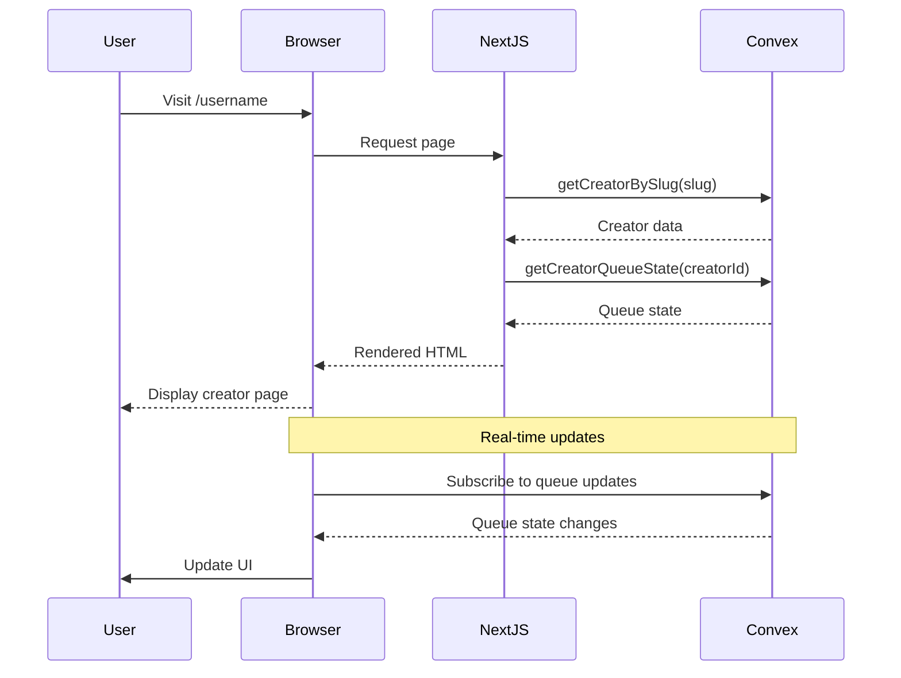
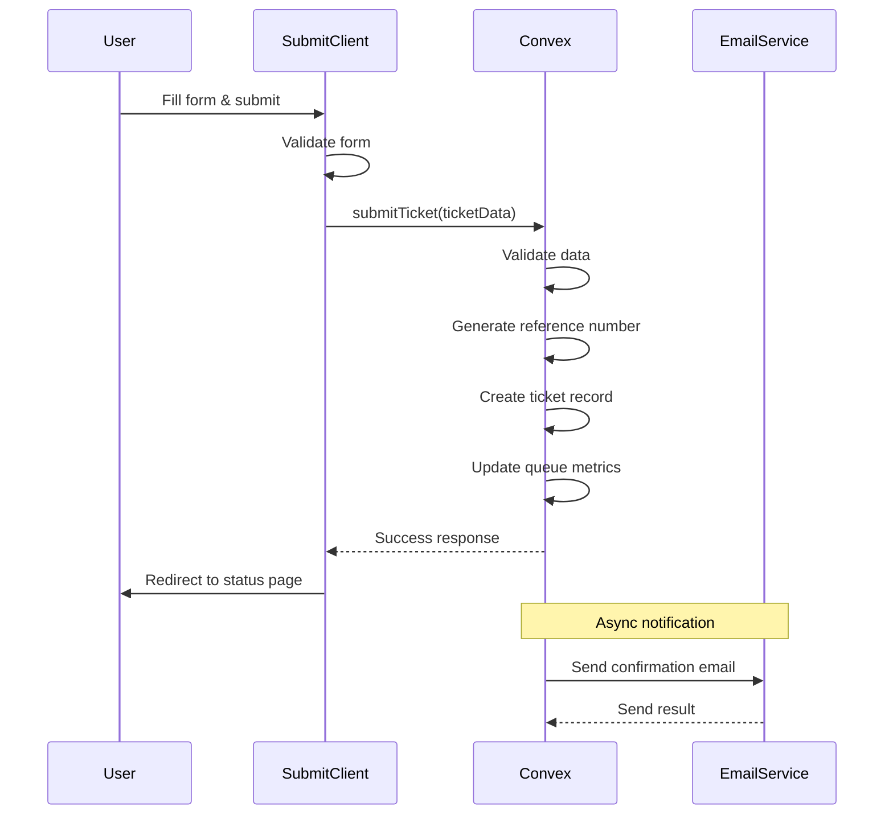
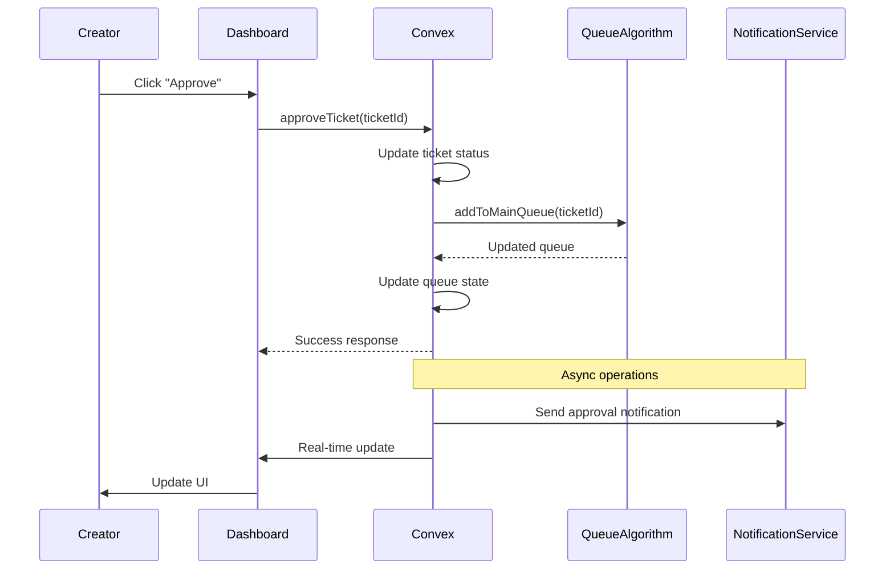
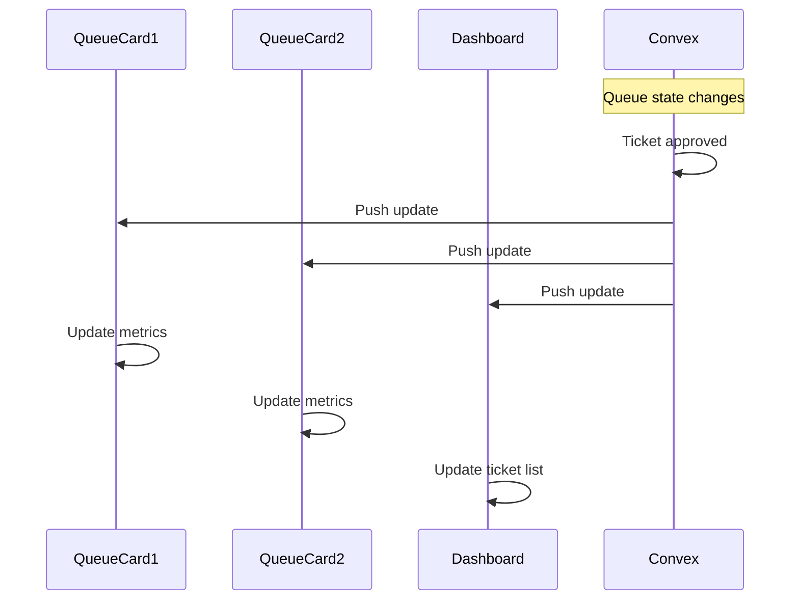

# API Endpoints and Data Flow Documentation

## Overview

This document outlines all the API endpoints, data flow patterns, and interactions between the frontend and Convex backend. The system uses Convex functions instead of traditional REST APIs, but the patterns are similar for clarity.

## API Endpoint Mapping

### Public-Facing Endpoints (Page Routes)

| Route               | Method | Purpose                       | Data Source       | Response                 |
| ------------------- | ------ | ----------------------------- | ----------------- | ------------------------ |
| `/[slug]`           | GET    | Creator page with queue cards | Server-side fetch | HTML with queue data     |
| `/[slug]/submit`    | GET    | Ticket submission form        | Server-side fetch | HTML with form data      |
| `/status/[ref]`     | GET    | Ticket status page            | Server-side fetch | HTML with ticket data    |
| `/dashboard/[slug]` | GET    | Creator dashboard             | Server-side fetch | HTML with dashboard data |

### Convex Functions (Backend Operations)

#### Creator Functions

| Function                    | Type     | Purpose             | Args               | Returns          |
| --------------------------- | -------- | ------------------- | ------------------ | ---------------- |
| `creators.getCreatorBySlug` | Query    | Get creator by slug | `{ slug: string }` | `Creator`        |
| `creators.createCreator`    | Mutation | Create new creator  | Creator data       | `Id<"creators">` |

#### Queue Functions

| Function                      | Type  | Purpose             | Args                       | Returns          |
| ----------------------------- | ----- | ------------------- | -------------------------- | ---------------- |
| `queues.getCreatorQueueState` | Query | Get queue state     | `{ creatorId }`            | `QueueState`     |
| `queues.getQueueState`        | Query | Get specific queue  | `{ creatorId, queueType }` | `QueueData`      |
| `queues.getMainQueue`         | Query | Get main queue      | `{ creatorId }`            | `Ticket[]`       |
| `queues.getTicketPosition`    | Query | Get ticket position | `{ ticketId }`             | `number \| null` |

#### Ticket Functions

| Function                       | Type     | Purpose             | Args                                 | Returns                         |
| ------------------------------ | -------- | ------------------- | ------------------------------------ | ------------------------------- |
| `tickets.submitTicket`         | Mutation | Submit new ticket   | Ticket data                          | `{ ticketId, referenceNumber }` |
| `tickets.getTicketByReference` | Query    | Get ticket by ref   | `{ referenceNumber }`                | `Ticket`                        |
| `tickets.getTicketsByCreator`  | Query    | Get creator tickets | `{ creatorId, status?, queueType? }` | `Ticket[]`                      |
| `tickets.approveTicket`        | Mutation | Approve ticket      | `{ ticketId }`                       | `boolean`                       |
| `tickets.rejectTicket`         | Mutation | Reject ticket       | `{ ticketId }`                       | `boolean`                       |
| `tickets.completeTicket`       | Mutation | Complete ticket     | `{ ticketId }`                       | `boolean`                       |

## Data Flow Diagrams

### 1. Creator Page Load Flow



### 2. Ticket Submission Flow



### 3. Ticket Approval Flow



### 4. Real-time Queue Updates



## Request/Response Patterns

### 1. Query Pattern (Data Fetching)

```typescript
// Client-side
const queueState = useQuery(api.queues.getCreatorQueueState, {
  creatorId: "creator123",
});

// Server-side
const queueState = await convex.query(api.queues.getCreatorQueueState, {
  creatorId: "creator123",
});
```

### 2. Mutation Pattern (Data Updates)

```typescript
// Client-side
const submitTicket = useMutation(api.tickets.submitTicket);
const result = await submitTicket({
  creatorId: "creator123",
  queue: "priority",
  name: "John Doe",
  email: "john@example.com",
  // ... other fields
});

// Error handling
try {
  const result = await submitTicket(ticketData);
  // Handle success
} catch (error) {
  // Handle error
  console.error("Submission failed:", error);
}
```

### 3. Optimistic Updates Pattern

```typescript
// Apply optimistic update
const [optimisticTickets, setOptimisticTickets] = useState([]);

async function handleApprove(ticketId) {
  // Optimistic update
  setOptimisticTickets((prev) =>
    prev.map((t) => (t._id === ticketId ? { ...t, status: "approved" } : t))
  );

  try {
    await approveTicket({ ticketId });
    // Success - optimistic update matches reality
  } catch (error) {
    // Revert optimistic update
    setOptimisticTickets((prev) =>
      prev.map((t) => (t._id === ticketId ? { ...t, status: "pending" } : t))
    );
  }
}
```

## Error Handling Patterns

### 1. Validation Errors

```typescript
// Convex function
export const submitTicket = mutation({
  args: {
    // ... validation schema
  },
  handler: async (ctx, args) => {
    // Validate email
    if (!args.email.includes("@")) {
      throw new Error("Invalid email address");
    }

    // Validate minimum tip
    const creator = await ctx.db.get(args.creatorId);
    if (
      args.queueType === "priority" &&
      args.priorityTipCents < creator.minPriorityTipCents
    ) {
      throw new Error(
        `Minimum tip for priority is $${(
          creator.minPriorityTipCents / 100
        ).toFixed(2)}`
      );
    }

    // ... rest of function
  },
});
```

### 2. Not Found Errors

```typescript
// Client-side handling
const creator = useQuery(api.creators.getCreatorBySlug, { slug });

if (creator === undefined) {
  return <div>Loading...</div>;
}

if (creator === null) {
  notFound(); // Next.js 404
}
```

### 3. Network Error Handling

```typescript
// Custom hook for error handling
export function useApiCall() {
  const [loading, setLoading] = useState(false);
  const [error, setError] = useState(null);

  const execute = async (mutation, args) => {
    setLoading(true);
    setError(null);

    try {
      const result = await mutation(args);
      return result;
    } catch (err) {
      setError(err.message);
      throw err;
    } finally {
      setLoading(false);
    }
  };

  return { execute, loading, error };
}
```

## Real-time Subscription Patterns

### 1. Queue State Subscription

```typescript
// Auto-subscribe to queue updates
function QueueCard({ creatorId, queueType }) {
  const queueData = useQuery(api.queues.getQueueState, {
    creatorId,
    queueType,
  });

  // Automatically updates when queue changes
  return (
    <div>
      <div>Next Turn: {queueData?.nextTurn}</div>
      <div>ETA: {formatEta(queueData?.etaMins)}</div>
    </div>
  );
}
```

### 2. Ticket List Subscription

```typescript
// Subscribe to ticket list changes
function TicketList({ creatorId, status }) {
  const tickets = useQuery(api.tickets.getTicketsByCreator, {
    creatorId,
    status,
  });

  return (
    <div>
      {tickets?.map((ticket) => (
        <TicketCard key={ticket._id} ticket={ticket} />
      ))}
    </div>
  );
}
```

## Performance Optimization Patterns

### 1. Query Optimization

```typescript
// Efficient query with index
const pendingTickets = useQuery(api.tickets.getTicketsByCreator, {
  creatorId,
  status: "pending",
});

// Instead of fetching all tickets and filtering client-side
```

### 2. Subscription Management

```typescript
// Unsubscribe from unnecessary data
function Dashboard({ creatorId }) {
  const [activeTab, setActiveTab] = useState("new");

  // Only subscribe to relevant tickets
  const tickets = useQuery(api.tickets.getTicketsByCreator, {
    creatorId,
    status: activeTab === "new" ? "pending" :
            activeTab === "approved" ? "approved" : undefined
  });

  return (
    // ... dashboard UI
  );
}
```

### 3. Batching Operations

```typescript
// Batch approval
async function batchApprove(ticketIds) {
  const promises = ticketIds.map((id) => approveTicket({ ticketId: id }));
  await Promise.all(promises);
}
```

## Security Patterns

### 1. Authentication Check

```typescript
// Server-side protection
export default async function DashboardPage({ params }) {
  const session = await auth();
  const { slug } = await params;

  if (!session || session.user.slug !== slug) {
    redirect(`/login?redirect=/dashboard/${slug}`);
  }

  // ... rest of component
}
```

### 2. Authorization in Functions

```typescript
// Verify ownership in mutations
export const approveTicket = mutation({
  args: { ticketId: v.id("tickets") },
  handler: async (ctx, { ticketId }) => {
    const ticket = await ctx.db.get(ticketId);
    if (!ticket) {
      throw new Error("Ticket not found");
    }

    // Verify user owns this creator's tickets
    const creator = await ctx.db.get(ticket.creatorId);
    if (creator.ownerId !== ctx.auth.userId) {
      throw new Error("Unauthorized");
    }

    // ... proceed with approval
  },
});
```

### 3. Input Sanitization

```typescript
// Validate and sanitize inputs
export const submitTicket = mutation({
  args: {
    name: v.string(),
    email: v.string(),
    needText: v.string(),
    attachments: v.array(v.string()),
  },
  handler: async (ctx, args) => {
    // Sanitize HTML if needed
    const cleanNeedText = sanitizeHtml(args.needText);

    // Validate URLs
    const cleanAttachments = args.attachments
      .map((url) => sanitizeUrl(url))
      .filter(Boolean);

    // ... proceed with sanitized data
  },
});
```

## Monitoring and Analytics

### 1. Request Tracking

```typescript
// Track API usage
export const submitTicket = mutation({
  args: {
    /* ... */
  },
  handler: async (ctx, args) => {
    const startTime = Date.now();

    try {
      // ... function logic
      const result = await createTicket(ctx, args);

      // Track success
      await ctx.db.insert("analytics", {
        type: "ticket_submitted",
        creatorId: args.creatorId,
        duration: Date.now() - startTime,
        success: true,
      });

      return result;
    } catch (error) {
      // Track failure
      await ctx.db.insert("analytics", {
        type: "ticket_submitted",
        creatorId: args.creatorId,
        duration: Date.now() - startTime,
        success: false,
        error: error.message,
      });

      throw error;
    }
  },
});
```

### 2. Performance Monitoring

```typescript
// Client-side performance tracking
function usePerformanceMonitor(operationName) {
  return useCallback(
    async (operation) => {
      const startTime = performance.now();

      try {
        const result = await operation();

        // Log performance
        console.log(`${operationName} took ${performance.now() - startTime}ms`);

        return result;
      } catch (error) {
        console.error(`${operationName} failed:`, error);
        throw error;
      }
    },
    [operationName]
  );
}
```
