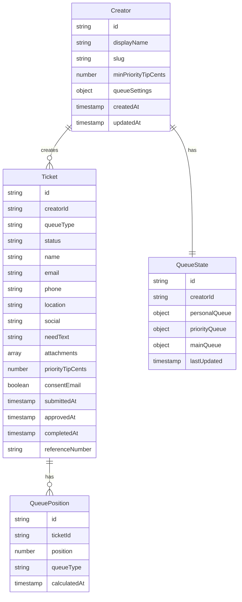

# Data Model Architecture

## Entity Relationship Diagram



## Convex Schema Definition

### creators Table

```typescript
{
  id: Id<"creators">,
  displayName: string,
  slug: string,
  minPriorityTipCents: number,
  queueSettings: {
    personalEnabled: boolean,
    priorityEnabled: boolean,
  },
  createdAt: number,
  updatedAt: number,
}
```

### tickets Table

```typescript
{
  id: Id<"tickets">,
  creatorId: Id<"creators">,
  queueType: "personal" | "priority",
  status: "pending" | "approved" | "rejected" | "completed",
  name: string,
  email: string,
  phone?: string,
  location?: string,
  social?: string,
  needText: string,
  attachments: string[],
  priorityTipCents: number,
  consentEmail: boolean,
  submittedAt: number,
  approvedAt?: number,
  completedAt?: number,
  referenceNumber: string,
}
```

### queueStates Table

```typescript
{
  id: Id<"queueStates">,
  creatorId: Id<"creators">,
  personalQueue: {
    activeTurn: number | null,
    nextTurn: number,
    activeCount: number,
    etaMins: number | null,
    enabled: boolean,
  },
  priorityQueue: {
    activeTurn: number | null,
    nextTurn: number,
    activeCount: number,
    etaMins: number | null,
    enabled: boolean,
  },
  mainQueue: Id<"tickets">[],
  lastUpdated: number,
}
```

## Data Flow

### Ticket Submission Flow

1. User submits ticket via form
2. Ticket created with "pending" status
3. Reference number generated
4. Queue state updated with new ticket count
5. Notification sent to creator (future)

### Approval Workflow

1. Creator reviews pending tickets
2. Approves or rejects ticket
3. If approved:
   - Status changes to "approved"
   - Ticket added to main queue
   - Main queue reordered with 3:1 priority:personal ratio
   - Queue positions recalculated
4. If rejected:
   - Status changes to "rejected"
   - No further action required

### Main Queue Algorithm

1. Separate approved tickets into priority and personal buckets
2. Interleave tickets following 3:1 ratio (3 priority, 1 personal)
3. Maintain original order within each bucket
4. Calculate position numbers dynamically
5. Update ETA estimates based on current queue length

## Indexing Strategy

### Critical Indices

- `creators` by `slug` (for creator page lookup)
- `tickets` by `creatorId` and `status` (for dashboard queries)
- `tickets` by `creatorId` and `queueType` (for queue state calculations)
- `tickets` by `referenceNumber` (for status page lookup)
- `queueStates` by `creatorId` (for queue state updates)

## Real-time Updates

### WebSocket Subscriptions

- Creator dashboard: Subscribe to ticket status changes
- Queue cards: Subscribe to queue state changes
- Status page: Subscribe to individual ticket updates

### Data Invalidation

- When ticket is approved: Invalidate queue state and positions
- When ticket is completed: Update queue positions and ETA
- When new ticket submitted: Update queue counts and ETAs
