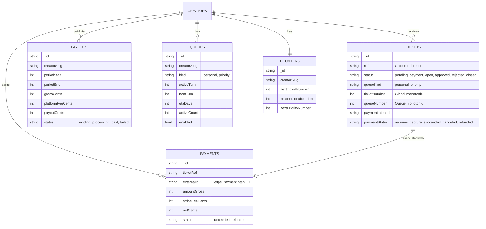

# System Architecture

## High-Level Overview

This diagram shows the major components of the "Please Please Please" application and how they interact.

```mermaid
graph TD
    User["User / Fan"]
    Creator[Creator]
    
    subgraph Frontend["Frontend (Next.js)"]
        SubmitPage[Submit Page]
        Dashboard[Creator Dashboard]
        PublicPage[Public Queue Page]
    end
    
    subgraph Backend["Backend (Convex)"]
        TicketEngine["Ticket Engine (Queue Logic)"]
        StripeEngine["Stripe Engine (Financials)"]
        DB[("Convex DB")]
        
        DB --> TicketEngine
        DB --> StripeEngine
    end
    
    subgraph External["External Services"]
        Stripe[Stripe Payments]
        Resend[Resend Emails]
    end

    User -->|Submits Ticket| SubmitPage
    SubmitPage -->|Personal (Free)| DB
    SubmitPage -->|Priority (Paid)| Stripe
    Stripe -->|Webhook| DB
    
    Creator -->|Approves/Rejects| Dashboard
    Dashboard -->|Mutations| DB
    
    DB -->|Realtime Updates| PublicPage
    DB -->|Realtime Updates| Dashboard
    
    TicketEngine -->|Calculates Order| Dashboard
    TicketEngine -->|Calculates Order| PublicPage
    
    StripeEngine -->|Calculates Earnings| Dashboard
```

## Payment & Ticket Lifecycle (v3 Flow)

 This sequence diagram illustrates the "Authorize Now, Capture Later" flow.


## Ticket Engine Logic (3:1 Ratio)

This diagram explains how the `ticketEngine` prioritizes tickets using the 3:1 Interleaving algorithm.


## Database Schema Relations

Simplified view of the core data models in Convex.


